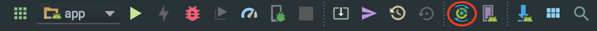

# EcoSnap

Environmentally conscious Android application that utilizes Deep Learning to classify whether an object is recyclable or non-recyclable. 


## Project Description 

This application was created for our Android Mobile Development course to serve as the final product that allowed us to demonstrate our proficiency with the Android ecosystem. Initially our group wanted to recreate [Not Hotdog](https://itunes.apple.com/us/app/not-hotdog/id1212457521?mt=8), the famous mobile app from HBO’s hit [Silicon Valley](https://www.hbo.com/silicon-valley), but was later influenced by a greater cause. A greater cause coming in the form of a group member that had minimum knowledge on how to recycle. His lack of knowledge was hurting the Earth, and as a result we wanted to create a solution that benefitted those who share the same lack of knowledge on recycling. This resulted in us pivoting to create an app that allowed users to utilize the camera on their phone to distinguish between objects that may or may not be recyclable. 

## Installation

```
git clone https://github.com/bdinh/ecosnap.git
```

## Getting Started

Upon successfully cloning the repository, we reccommend opening up the project in AndroidStudio. If you don't have it installed already, go [install AndroidStudio](https://developer.android.com/studio/). This project was built on version 3.0+ and thus it's encourage that yours also supports the same version.

After opening up the project, ensure that you sync the project with the gradle files. This can be found on the top right corner of AndroidStudio IDE.



You will most likely run into missing dependency warnings, feel free to install any missing dependencies. Afterwards, you'll need to either set up an Android Device or set up the emulator with camera access.

- Follow [these instructions](https://developer.android.com/studio/debug/dev-options#enable) for Android Device.
- Follow [these instructions](https://developer.android.com/studio/run/emulator) for Android Emulator. Be sure to **enable** the device's camera!


Once the application is running, make sure you allow the application to access your camera and files. You're all set after you've reach this step. If you're struggling, feel free to submit an issue and one of us will gladly take a look at it.


## Future Updates
Below are a list of updates that the team is currently working to support. 

- Newly generated dataset with more classes in order to break down your snap.
- View Pager in order to support _SnapChat_ layout
- Complete overhaul of the current backend. 
	- Servers to retrain model, handle authentication, data storage, etc.
- React Native build to support Android and iOS.
- Optimization of memory consumption with the current state of the application.


## Meet the Team

[Aaron Nguyen](https://github.com/aaronluannguyen "aaronluannguyen")

[Bao Dinh](https://github.com/bdinh "bdinh")

[Eric Jacobson](https://github.com/EJacobson96 "EJacobson96")

[Wynston Hsu](https://github.com/wynhsu "wynhsu")
